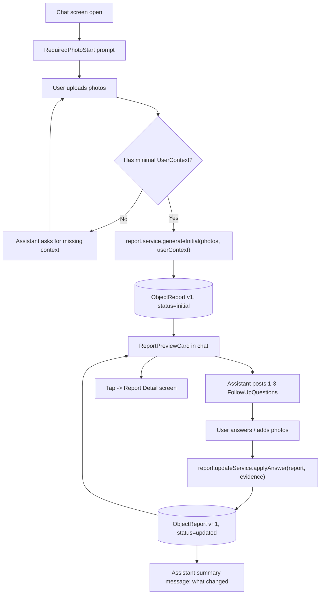

# Architecture

## Stack

- **Expo SDK** with **Expo Router** (file-based routing under `src/app`).
- **TypeScript** with `tsconfig.json` set to `"strict": true`, `"noUncheckedIndexedAccess": true`, and `"exactOptionalPropertyTypes": true`. No `any`.
- **React Native Web** for the web target.
- **NativeWind** for styling (Tailwind classes via `className`).
- **i18next + react-i18next + expo-localization** for i18n.
- State: **`useReducer`** first. Zustand only if a cross-screen need actually appears; do not pre-add it.
- **`expo-image-picker`** is a required dependency. At runtime, if a picker call rejects (web blob failure, denied permission, unsupported environment), the composer falls back to a deterministic mock attachment that returns placeholder URIs behind the same interface so the rest of the flow stays exercisable.

No other dependencies are added without justification (see [.cursor/rules/project.md](../.cursor/rules/project.md)).

## Folder layout

```
/src
  /app
    _layout.tsx              # Root layout: i18n + ChatProvider + ReportProvider, Stack
    index.tsx                # Chat screen (main entry)
    report/[id].tsx          # Report detail screen
    saved.tsx                # Saved reports placeholder
    settings.tsx             # Settings + language switcher

  /components
    /chat
      ChatMessageBubble.tsx
      ChatComposer.tsx
      PhotoAttachmentPreview.tsx
      RequiredPhotoStart.tsx
    /report
      ReportPreviewCard.tsx
      ReportDetail.tsx
      ChecklistCard.tsx
      ScoreBadge.tsx
      RecommendationBadge.tsx
      SellerModeUpsellCard.tsx
    /ui
      Button.tsx
      Card.tsx
      Screen.tsx
      TextInput.tsx

  /features
    /chat
      chat.types.ts          # ChatMessage, ChatState, action types (imports FollowUpQuestion from ../report/report.types)
      chat.reducer.ts        # Pure reducer over chat state
      chat.provider.tsx      # ChatProvider + useChat() hook
      chat.mockData.ts       # Seed messages, demo flows
    /report
      report.types.ts        # ObjectReport, Answer, et al.
      report.reducer.ts      # Pure reducer over report state
      report.provider.tsx    # ReportProvider + useLatestReport() / useReportById(id) hooks
      report.mockData.ts     # Sample reports
      report.service.ts      # generateInitial(input) -> Promise<ObjectReport>
      report.updateService.ts# applyAnswer / applyPhotos -> Promise<ObjectReport>
    /i18n
      index.ts               # init i18next, detect device locale, expose t
      en.json
      ja.json

  /lib
    id.ts                    # newId() helper
    dates.ts                 # nowIso(), formatters
```

## Separation of concerns

- **`features/chat`** owns chat UI state only: the message list, composer drafts, attached photos. It never computes valuations.
- **`features/report`** owns the `ObjectReport` lifecycle. `report.service.ts` produces an initial report from photos + `UserContext`. `report.updateService.ts` takes an existing report plus an `Answer` (or new photos) and returns the next report with an incremented `version`.
- **Components** are presentational. They receive typed props and call callbacks. No fetch, no IO, no service calls inside components.
- **Services are pure and deterministic.** Same inputs ⇒ same outputs. They are **async** from day one (`Promise<ObjectReport>`) so call sites do not change when real AI replaces the mocks.

### Type-file dependency direction

`chat.types.ts` imports from `report.types.ts` (specifically `FollowUpQuestion` and `Answer`). The reverse direction is forbidden — the report engine must remain unaware of chat UI types. See [report-schema.md](report-schema.md#type-file-layout-and-dependency-direction).

## Data flow



The `ObjectReport` is the single source of truth. The chat reducer holds messages and a reference (id) to the latest report; the report itself lives in `ReportProvider`. UI reads valuation data exclusively from the report.

## State containers

There are two pure reducers, each behind its own provider mounted in `_layout.tsx`. The chat screen consumes both via hooks; no global store.

### Chat state (`features/chat/chat.reducer.ts`)

```ts
type ChatState = {
  messages: ChatMessage[];
  draft: string;
  pendingPhotos: string[];     // staged in composer, not yet sent
  latestReportId: string | null;
};
```

Actions:

- `SET_DRAFT` — replace the composer draft text.
- `STAGE_PHOTOS` — append URIs to `pendingPhotos`.
- `CLEAR_PENDING_PHOTOS` — clear `pendingPhotos` (called after `ADD_USER_PHOTOS` is dispatched on send).
- `ADD_USER_TEXT` — append a user text message.
- `ADD_USER_PHOTOS` — append a user photo-upload message with `imageUris`.
- `ADD_ASSISTANT_TEXT` — append an assistant text message (used for prompts and change summaries).
- `ADD_REPORT_PREVIEW` — append an assistant message of `kind: "report_preview"` referencing a `reportId`; updates `latestReportId`.
- `ADD_QUESTION` — append an assistant message of `kind: "question"` carrying a `FollowUpQuestion`.
- `ANSWER_QUESTION` — append a user message tied to an `Answer` payload and mark the corresponding question `answered: true`.
- `RESET_FOR_NEW_ANALYSIS` — clear messages, draft, pending photos, and `latestReportId`.

Exposed via `useChat()` returning `{ state, dispatch }`.

### Report state (`features/report/report.reducer.ts`)

```ts
type ReportState = {
  current: ObjectReport | null;   // single active report; null before generateInitial succeeds
};
```

Actions:

- `SET_REPORT` — replace `current` with the given `ObjectReport`. Used after every successful `generateInitial` / `applyAnswer` / `applyPhotos`.
- `RESET` — set `current` back to `null` (called on "New analysis").

Exposed via:

- `useLatestReport(): ObjectReport | null`
- `useReportById(id: string): ObjectReport | null` — returns `state.current` when `state.current?.id === id`, else `null`. The detail screen uses this to render its "report not found" empty state.

Both reducers are pure. Side effects (calling `report.service` / `report.updateService`) happen in the screen layer, which awaits the service and then dispatches the resulting actions.

## Per-user-event orchestration

Every user-initiated event in the chat screen follows the same dispatch order. Screens own this flow; components only emit callbacks.

**On send with text only (no pending photos), no current report:**
1. `chatDispatch(ADD_USER_TEXT)` and `chatDispatch(SET_DRAFT, "")`.
2. Free text without an active question is informational only; no service call.

**On send with text only, current report exists, an unanswered question is highest-priority:**
1. Build `Answer` from the text and the highest-priority unanswered `FollowUpQuestion` (see [report-schema.md](report-schema.md#free-text-answer-disambiguation)).
2. `chatDispatch(ANSWER_QUESTION, answer)` and `chatDispatch(SET_DRAFT, "")`.
3. `await report.updateService.applyAnswer(currentReport, answer)`.
4. `reportDispatch(SET_REPORT, next)`.
5. `chatDispatch(ADD_REPORT_PREVIEW, { reportId: next.id })`.
6. `chatDispatch(ADD_ASSISTANT_TEXT, summaryKey)` describing what changed.
7. For each new `FollowUpQuestion` produced, `chatDispatch(ADD_QUESTION, q)`.

**On send with pending photos, no current report yet:**
1. `chatDispatch(ADD_USER_PHOTOS, { imageUris: pendingPhotos })`.
2. `chatDispatch(CLEAR_PENDING_PHOTOS)`.
3. `await report.service.generateInitial({ photos, userContext })`.
4. `reportDispatch(SET_REPORT, initial)`.
5. `chatDispatch(ADD_REPORT_PREVIEW, { reportId: initial.id })`.
6. `chatDispatch(ADD_ASSISTANT_TEXT, t('report.preview.summary.initial'))`.
7. For each `FollowUpQuestion`, `chatDispatch(ADD_QUESTION, q)`.

**On send with pending photos, current report exists:**
1. `chatDispatch(ADD_USER_PHOTOS, ...)` then `CLEAR_PENDING_PHOTOS`.
2. `await report.updateService.applyPhotos(currentReport, newPhotos)`.
3. Same `SET_REPORT` + `ADD_REPORT_PREVIEW` + summary + question dispatches as the answer flow.

**On "New analysis":**
1. `chatDispatch(RESET_FOR_NEW_ANALYSIS)`.
2. `reportDispatch(RESET)`.
3. `chatDispatch(ADD_ASSISTANT_TEXT, t('chat.start.requirePhotoPrompt'))`.

While the awaited service is in flight, the screen renders a translated "analysing" indicator (typing-dots row in the chat). Errors are caught and surfaced as a translated assistant message; the report state is not changed.

## i18n rules

- Every visible string is loaded via `t('key')`. No literal user-facing text in JSX.
- Keys are grouped by feature with dot-notation: `chat.*`, `report.*`, `settings.*`, `common.*`.
- `en.json` and `ja.json` are mandatory; every new key must land in both files in the same change.
- Initial language is detected via `expo-localization`.
- The language switcher lives **only** in Settings in MVP. There is no header switcher.
- The override is held **in-memory only** in MVP — reloading the app reverts to the device locale. Persistence (e.g. AsyncStorage) is a follow-up that lands together with the persistence adapter.
- Use i18next interpolation (`t('key', { count })`) — never template-literal concatenation of translated fragments.

## Header

The chat screen's header is intentionally minimal:

- App title (translated).
- A "New analysis" button visible whenever a report exists; tapping it triggers the New-analysis dispatches above (after a translated confirm dialog).
- A link/icon to Settings.

No language switcher in the header. No mode toggle (Seller Mode is locked).

## Future swap-in points

These are the only seams we need to keep clean for the MVP:

- **Real AI** replaces the bodies of `report.service.generateInitial` and `report.updateService.applyAnswer` / `applyPhotos`. The async signatures and return types are already in place, so call sites in screens stay identical. Loading and error states already exist in the orchestration above.
- **Supabase** is added as a thin persistence adapter under `src/lib/persistence` (not created in MVP). Reducers remain pure; a top-level effect hydrates state on boot and writes through on commit. Language preference also moves here.
- **Payments** unlock Seller Mode by flipping a single feature flag read by `SellerModeUpsellCard` and `ReportDetail`. No payment logic in the MVP.
- **FX conversion** lands as `src/lib/currency` and replaces the converted-price placeholder defined in [report-schema.md](report-schema.md#converted-price-mvp).
